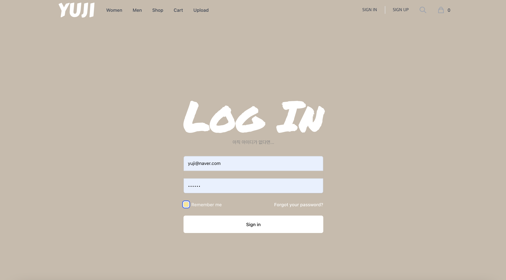
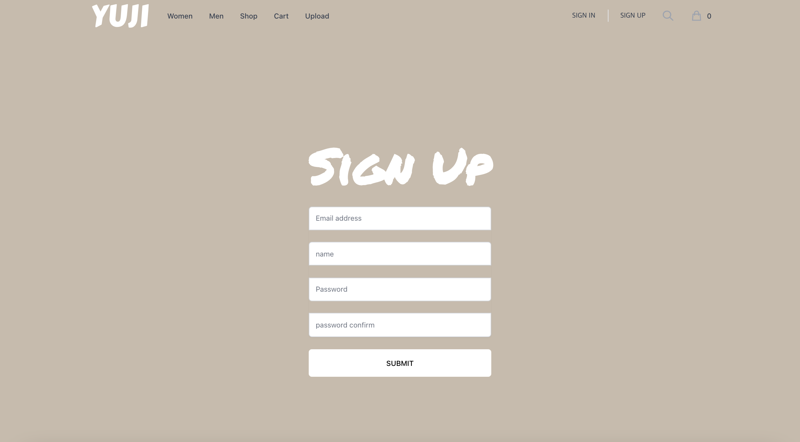
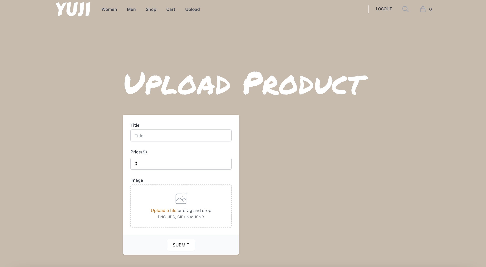
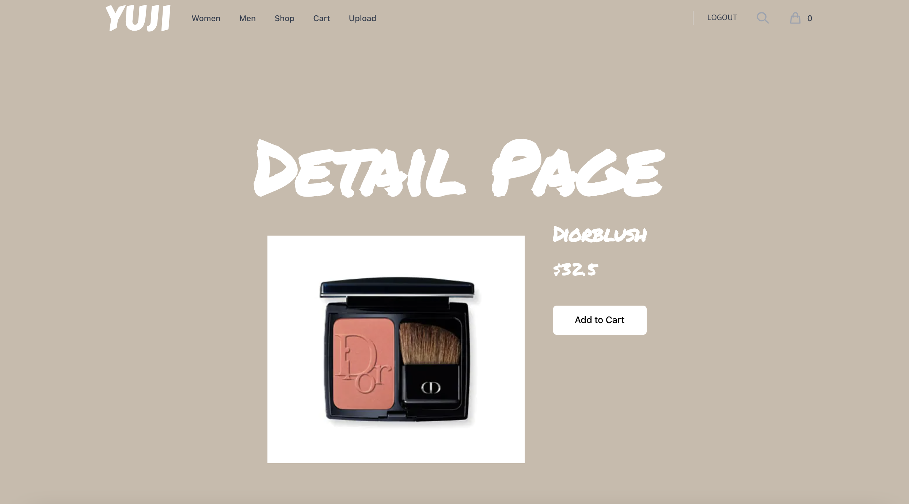
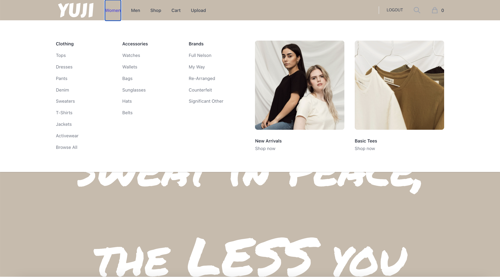
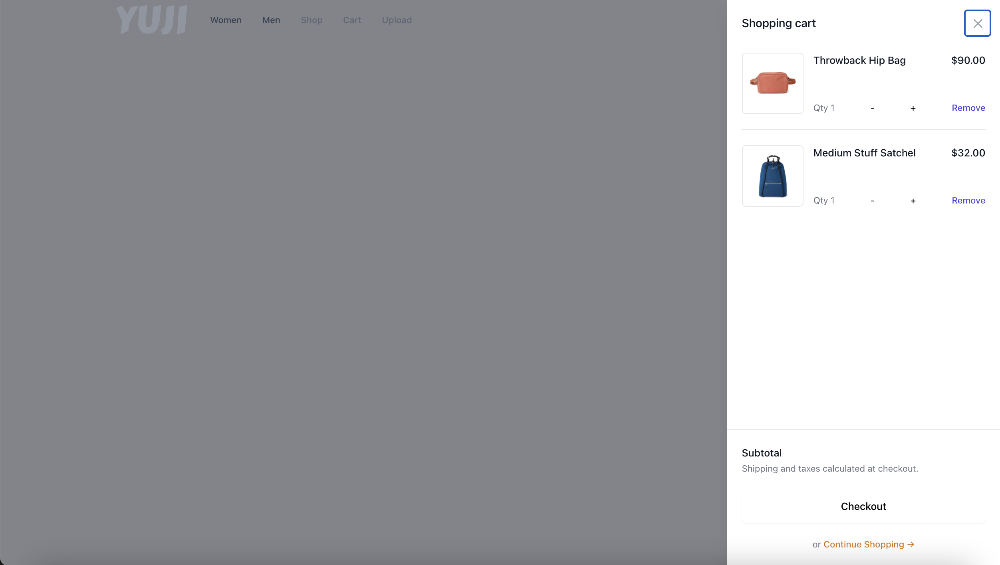

# 🛒 2021 Shop Project (React, Nodejs)

https://yoojiih.shop

개인프로젝트

## Development Configuration

이 프로젝트는 `Create React App`으로 만들어졌습니다.

Repository를 다운 받은 후(clone), 해당 디렉토리에서 아래 명령어를 실행 시 서버 & 클라이언트 동시에 실행

```bash
$ cd client
$ npm install
$ cd ..
$ npm install
$ npm run dev
```

# Feature

이 프로젝트는 기본적인 기능을 담은 쇼핑몰 서비스를 구현하였습니다.

## 기술적 요소

- mongo db를 연결 후 user Model과 Schema 생성
- Body-parser라는 Dependency를 시용해 browser 측에서 정보 입력하면 서버측에서 받아서 처리해 Client와 Server간의 통신을 구현
- NODE MON(tool) 사용해 소스 변경 시 변화를 감지해서 자동으로 서버 재시작해줌
- Bcrypt를 사용해 관리자도 암호를 모르게 암호화 (salt + hash)
- jsonwebtoken을 사용해 토큰 생성 (Auth - login 시 비밀번호까지 맞다면 그 유저를 위한 토큰 생성해줌) & findByToken 메소드 생성해 복호화
- 토큰 저장을 위해 cookie-parser 설치
- Auth middleware를 통해 유저 모델 내 해당 유저 존재 여부에 따라 그대로 진행할지 빠져나갈지 결정
- 로그아웃 시 토큰을 지워줌으로써 로그인 기능 풀리도록 함
- Concurrently를 이용해 front, back 서버 한번에 켬
- Cross-Origin Resource Sharing(CORS) 이슈를 둘 사이에서 대리로 통신하는 Proxy를 사용해 해결
- 데이터 요청시 axios 라이브러리를 사용해서 보냄
- Redux를 통해 컴포넌트끼리의 데이터 전달이 아닌 global 저장소를 통한 상태관리 구현
- `react-router-dom'을 사용해 페이지간 이동을 구햔
- 회원가입 페이지는 React Hook Form (state 대체)을 통해, 로그인 페이지는 state(useState)를 통해 <form>의 유효성 검사를 하여 둘의 차이점을 명확히 나타내고자 함
- 회원가입 페이지에서 회원가입 버튼 누른 후엔 유저 생성 처리중이기 때문에 setLoading state로 다시 못누르게 막음
- 에러메시지를 브라우저 상에 표시해 사용자가 원인 파악이 가능하도록 함
- Auth 컴포넌트를 HOC로 설정 후 다른 모든 컴포넌트들을 집어 넣고 backend에다가 request를 날려 현재 페이지에 들어와있는 사람의 상태정보를 HOC로 가지지고 옴으로써 페이지별 인증 컨트롤 구현
- IaaS(AWS) 서비스 이용해 배포
- 비밀정보 보호를 위해 개발환경을 로컬모드(development)와 배포모드(production)로 구분해 환경변수(process.env.NODE_ENV)를 따로 설정
- pm2로 터미널 종료시켜도 서버 종료되지 않고 계속 실행되게함

## 기능적 요소

- 회원가입, 로그인/로그아웃
- 새 제품 등록, 이미지 첨부
- 장바구니 내 항목 추가, 삭제, 수량변경

# Landing


# Sign in



# Sign up



# Upload



# Product List


# Product Detail Page



# NavBar



# Shopping Bag


